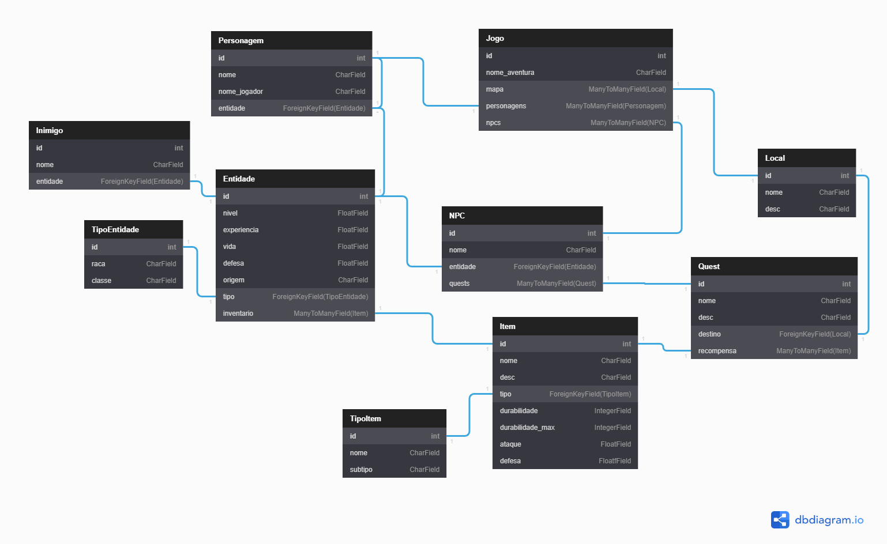

# Trabalho de programação
Trabalho para aula de Programação 2. \
Abaixo uma imagem com o diagrama de Entidade e Relacionamento do Banco de Dados, e logo abaixo o `json` que contém o resultado do `model_to_dict` de uma instância de `Jogo` e ao final tabelas representando as classes e suas respectivas colunas.

## Diagrama
Criado através do site [dbdiagram.io](https://dbdiagram.io)


## JSON
Criado através das seguintes linhas
```python
jogo_dict = model_to_dict(jogo, manytomany=True, recurse=True)
print(json.dumps(jogo_dict))
```

```json
{
  "mapa": [
    {
      "id": 1,
      "nome": "Ionia",
      "desc": "Rodeada por águas traiçoeiras, Ionia é composta por várias províncias aliadas dispersas ao longo do arquipélago gigantesco conhecido como as Primeiras Terras."
    },
    {
      "id": 2,
      "nome": "Freljord",
      "desc": "É uma terra severa e implacável. Orgulhoso e ferozmente independente, seu povo é composto de guerreiros natos, com uma forte cultura de saqueamento."
    },
    {
      "id": 3,
      "nome": "Ixtal",
      "desc": "Reconhecida por seu domínio da magia elemental, Ixtal foi uma das primeiras nações independentes que se uniram ao império shurimane."
    }
  ],
  "personagens": [
    {
      "id": 1,
      "nome": "Jhin",
      "nome_jogador": "Richard",
      "entidade": {
        "id": 1,
        "tipo": {
          "id": 1,
          "raca": "Humano",
          "classe": "Atirador"
        },
        "nivel": 9,
        "experiencia": 220.5,
        "vida": 1211.4,
        "ataque": 205,
        "defesa": 101.2,
        "origem": {
          "id": 1,
          "nome": "Ionia",
          "desc": "Rodeada por águas traiçoeiras, Ionia é composta por várias províncias aliadas dispersas ao longo do arquipélago gigantesco conhecido como as Primeiras Terras."
        }
      }
    }
  ],
  "npcs": [
    {
      "id": 1,
      "nome": "Gnar",
      "entidade": {
        "id": 3,
        "tipo": {
          "id": 3,
          "raca": "Yordle",
          "classe": "Lutador"
        },
        "nivel": 11,
        "experiencia": 240.5,
        "vida": 1527.7,
        "ataque": 291.8,
        "defesa": 210.2,
        "origem": {
          "id": 2,
          "nome": "Freljord",
          "desc": "É uma terra severa e implacável. Orgulhoso e ferozmente independente, seu povo é composto de guerreiros natos, com uma forte cultura de saqueamento."
        }
      }
    }
  ],
  "id": 1,
  "nome_aventura": "Lendas de Runeterra"
}
```

## Classes
### TipoItem
Nome da coluna | Tipo da coluna |
---------------|----------------|
nome           | CharField      |
subtipo        | CharField      |

### Item
Nome da coluna | Tipo da coluna |
---------------|----------------|
nome | CharField
desc | CharField
tipo | ForeignKeyField(TipoItem)
durabilidade | IntegerField(null=True)
durabilidade_max | IntegerField(null=True)
ataque | FloatField(null=True)
defesa | FloatField(null=True)

### Local
Nome da coluna | Tipo da coluna |
---------------|----------------|
nome | CharField
desc | CharField

### TipoEntidade
Nome da coluna | Tipo da coluna |
---------------|----------------|
raca | CharField
classe | CharField

### Entidade
Nome da coluna | Tipo da coluna |
---------------|----------------|
tipo | ForeignKeyField(TipoEntidade)
nivel | FloatField
experiencia | FloatField
vida | FloatField
ataque | FloatField
defesa | FloatField
origem | ForeignKeyField(Local)
inventario | ManyToManyField(Item)

### Inimigo
Nome da coluna | Tipo da coluna |
---------------|----------------|
nome | CharField
entidade | ForeignKeyField(Entidade)

### Personagem
Nome da coluna | Tipo da coluna |
---------------|----------------|
nome | CharField
nome_jogador | CharField
entidade | ForeignKeyField(Entidade)

### Quest
Nome da coluna | Tipo da coluna |
---------------|----------------|
nome | CharField
desc | CharField
destino | ForeignKeyField(Local)
recompensa | ManyToManyField(Item)

### NPC
Nome da coluna | Tipo da coluna |
---------------|----------------|
nome | CharField
entidade | ForeignKeyField(Entidade)
quests | ManyToManyField(Quest)

### Jogo
Nome da coluna | Tipo da coluna |
---------------|----------------|
nome_aventura | CharField
mapa | ManyToManyField(Local)
personagens | ManyToManyField(Personagem)
npcs | ManyToManyField(NPC)
